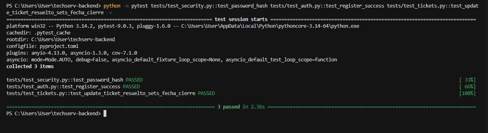

# Pruebas Unitarias — TechServ Backend

**Proyecto:** TechServ Backend  
**Framework:** [pytest](https://docs.pytest.org/) + `pytest-asyncio` + `httpx`  
**Fecha de ejecución:** Junio 2026  
**Suite completa:** 40 pruebas (`python -m pytest tests/ -q`)

---

## Introducción

Las pruebas unitarias verifican que una unidad mínima del código (función, método o regla de negocio) funcione correctamente de forma aislada. En este proyecto se implementaron pruebas sobre:

- Funciones puras de seguridad (`hash_password`, `verify_password`)
- Endpoint de registro de usuarios (`POST /auth/register`)
- Regla de negocio al cerrar un ticket (`fecha_cierre` cuando el estado pasa a `resuelto`)

Todas las pruebas son **automáticas**, **repetibles** y se ejecutan desde la terminal con un solo comando.

---

## Cómo ejecutar las pruebas

```bash
# Suite completa
python -m pytest tests/ -v

# Las tres pruebas documentadas en este informe
python -m pytest tests/test_security.py::test_password_hash tests/test_auth.py::test_register_success tests/test_tickets.py::test_update_ticket_resuelto_sets_fecha_cierre -v
```

---

## Prueba 1 — Hash y verificación de contraseñas

| Campo | Detalle |
|-------|---------|
| **Archivo** | `tests/test_security.py` |
| **Función bajo prueba** | `hash_password()` y `verify_password()` en `app/core/security.py` |
| **Tipo** | Prueba unitaria pura (sin base de datos ni HTTP) |

### Qué se probó

Se verificó que el módulo de seguridad:

1. Genere un hash bcrypt válido a partir de una contraseña en texto plano.
2. Valide correctamente la contraseña original contra el hash.
3. Rechace una contraseña incorrecta.

### Código de la prueba

```python
def test_password_hash():
    hashed = hash_password("secret123")
    assert verify_password("secret123", hashed)
    assert not verify_password("wrong", hashed)
```

### Resultado esperado

- `verify_password("secret123", hashed)` → `True`
- `verify_password("wrong", hashed)` → `False`

### Resultado obtenido

```
tests/test_security.py::test_password_hash PASSED
```

**Estado: PASSED** — Las funciones de hash y verificación responden según lo esperado en ambos escenarios (contraseña correcta e incorrecta).

---

## Prueba 2 — Registro exitoso de usuario

| Campo | Detalle |
|-------|---------|
| **Archivo** | `tests/test_auth.py` |
| **Endpoint bajo prueba** | `POST /api/v1/auth/register` |
| **Tipo** | Prueba de unidad sobre el flujo de registro (componente auth) |

### Qué se probó

Se comprobó que un usuario nuevo puede registrarse con rol `cliente` y reciba:

- Código HTTP `201 Created`
- Un `access_token` JWT
- Un `refresh_token`
- `token_type` igual a `"bearer"`

También se valida implícitamente que la contraseña se almacena hasheada y que el usuario queda persistido en la base de datos de prueba (SQLite en memoria).

### Código de la prueba

```python
@pytest.mark.asyncio
async def test_register_success(client: AsyncClient):
    response = await client.post(
        "/api/v1/auth/register",
        json={
            "email": "nuevo@techserv.local",
            "password": "secret123",
            "full_name": "Nuevo Cliente",
            "role": UserRole.CLIENTE,
        },
    )
    assert response.status_code == 201
    data = response.json()
    assert "access_token" in data
    assert "refresh_token" in data
    assert data["token_type"] == "bearer"
```

### Resultado esperado

| Verificación | Valor esperado |
|--------------|----------------|
| HTTP status | `201` |
| `access_token` | Presente en el JSON |
| `refresh_token` | Presente en el JSON |
| `token_type` | `"bearer"` |

### Resultado obtenido

```
tests/test_auth.py::test_register_success PASSED
```

**Estado: PASSED** — El registro devuelve ambos tokens y el tipo correcto. El flujo de autenticación para nuevos usuarios funciona correctamente.

---

## Prueba 3 — Cierre automático de ticket al marcar como resuelto

| Campo | Detalle |
|-------|---------|
| **Archivo** | `tests/test_tickets.py` |
| **Endpoint bajo prueba** | `PATCH /api/v1/tickets/{id}` |
| **Regla de negocio** | Al actualizar `estado` a `resuelto`, el sistema debe registrar `fecha_cierre` |

### Qué se probó

Se verificó la regla de negocio implementada en `app/api/v1/tickets.py`: cuando un administrador actualiza un ticket a estado `resuelto`, el campo `fecha_cierre` debe completarse automáticamente con la fecha/hora del cierre.

Escenario:

1. Existe un ticket en estado `abierto` (fixture `sample_ticket`).
2. Un admin envía `PATCH` con `{"estado": "resuelto"}`.
3. La respuesta debe reflejar el nuevo estado y una `fecha_cierre` no nula.

### Código de la prueba

```python
@pytest.mark.asyncio
async def test_update_ticket_resuelto_sets_fecha_cierre(
    client: AsyncClient,
    admin_token: str,
    sample_ticket: Ticket,
):
    response = await client.patch(
        f"/api/v1/tickets/{sample_ticket.id}",
        headers={"Authorization": f"Bearer {admin_token}"},
        json={"estado": EstadoTicket.RESUELTO},
    )
    assert response.status_code == 200
    data = response.json()
    assert data["estado"] == EstadoTicket.RESUELTO
    assert data["fecha_cierre"] is not None
```

### Resultado esperado

| Verificación | Valor esperado |
|--------------|----------------|
| HTTP status | `200` |
| `estado` | `"resuelto"` |
| `fecha_cierre` | Valor datetime no nulo |

### Resultado obtenido

```
tests/test_tickets.py::test_update_ticket_resuelto_sets_fecha_cierre PASSED
```

**Estado: PASSED** — La regla de cierre automático se aplica correctamente al resolver un ticket.

---

## Evidencia de ejecución

Salida completa al ejecutar las tres pruebas documentadas:

```
============================= test session starts =============================
platform win32 -- Python 3.14.2, pytest-9.0.3, pluggy-1.6.0
rootdir: C:\Users\User\techserv-backend
configfile: pyproject.toml
plugins: anyio-4.13.0, asyncio-1.3.0, cov-7.1.0
asyncio: mode=Mode.AUTO

collected 3 items

tests/test_security.py::test_password_hash PASSED                        [ 33%]
tests/test_auth.py::test_register_success PASSED                         [ 66%]
tests/test_tickets.py::test_update_ticket_resuelto_sets_fecha_cierre PASSED [100%]

============================== 3 passed in 2.40s ==============================
```

Salida de la suite completa (40 pruebas):

```
python -m pytest tests/ -q
........................................                                 [100%]
40 passed in ~29s
```

## Evidencia de ejecución


---

## Resumen

| # | Prueba | Componente | Escenario | Resultado |
|---|--------|------------|-----------|-----------|
| 1 | `test_password_hash` | `hash_password` / `verify_password` | Contraseña correcta e incorrecta | PASSED |
| 2 | `test_register_success` | `POST /auth/register` | Registro de cliente nuevo | PASSED |
| 3 | `test_update_ticket_resuelto_sets_fecha_cierre` | `PATCH /tickets/{id}` | Cierre con `fecha_cierre` automática | PASSED |

Las tres pruebas confirman comportamiento correcto en capas distintas del sistema: **seguridad**, **autenticación** y **lógica de negocio de tickets**, cumpliendo con el objetivo de detectar errores temprano y facilitar el mantenimiento del backend TechServ.
